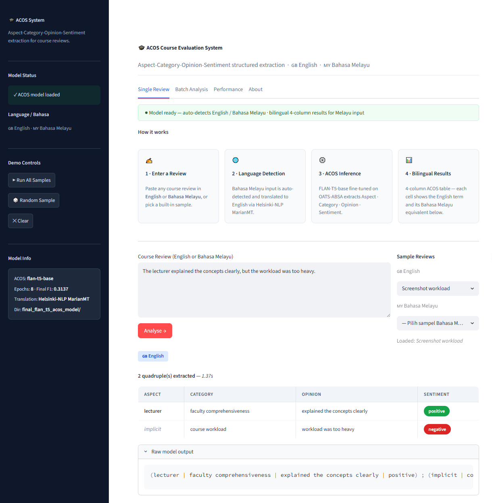
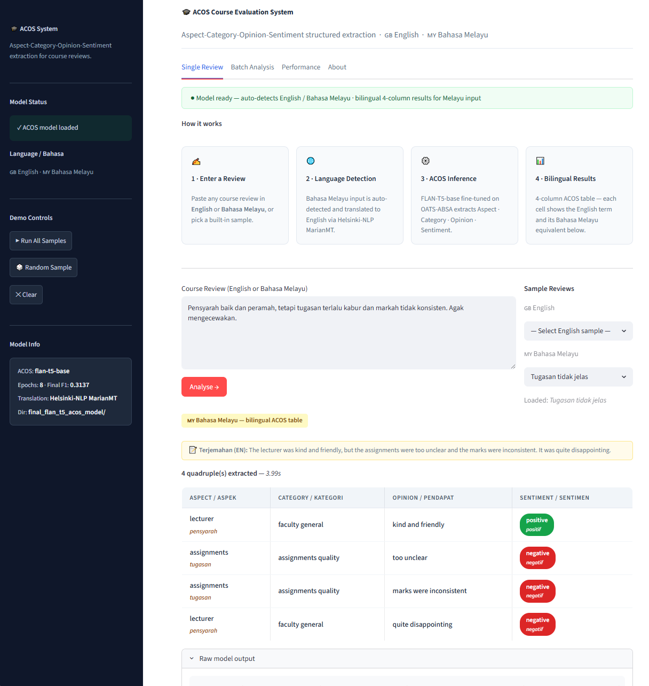
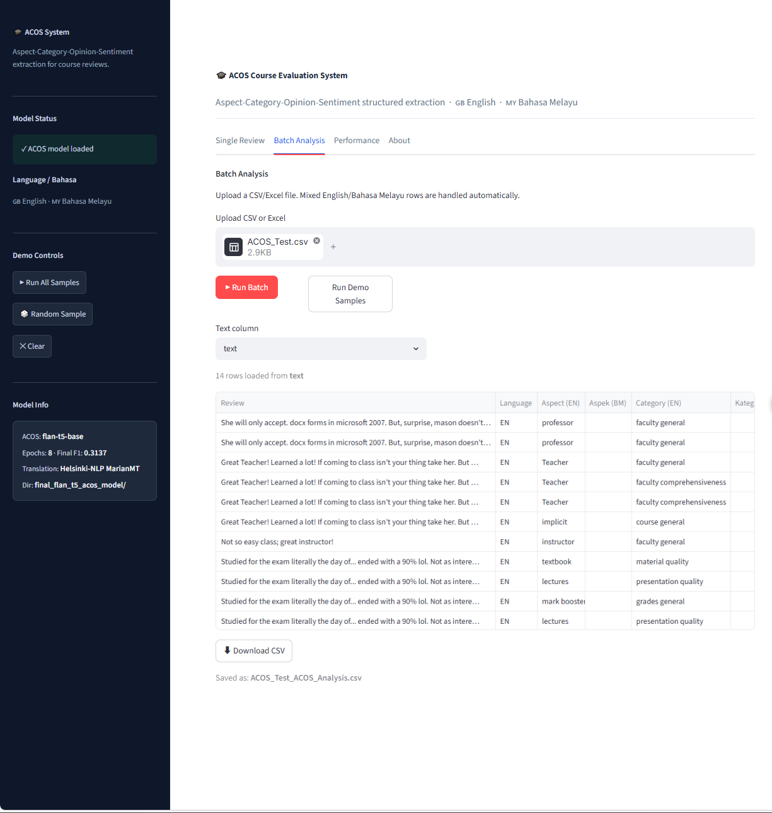
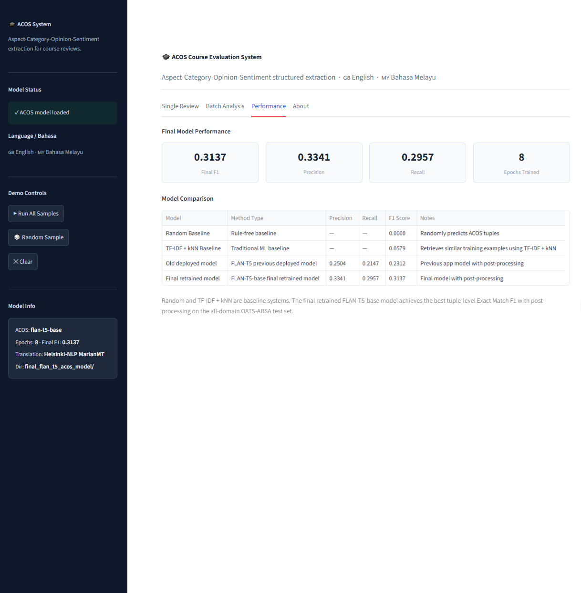
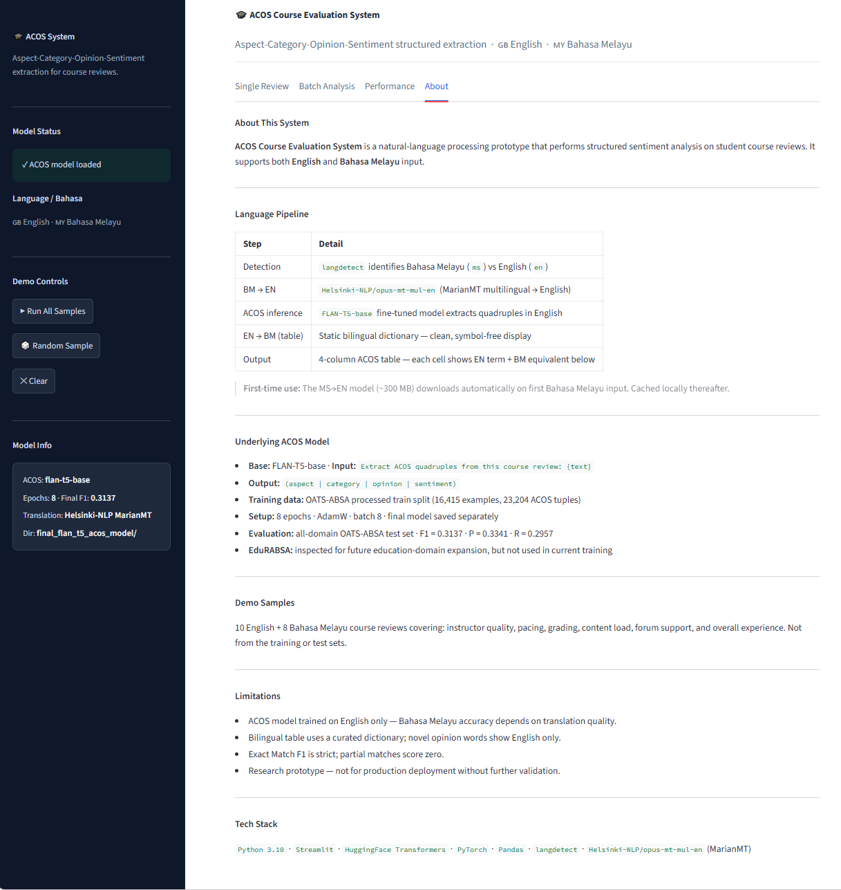

# Course ACOS Extraction / ACOS Course Evaluation System

## Project Overview

Course ACOS Extraction is an NLP system for extracting structured feedback from university course review text. Instead of only predicting whether a review is positive or negative, the system extracts ACOS quadruples:

- Aspect
- Category
- Opinion
- Sentiment

The project provides a Streamlit interface for:

- Single review analysis
- Batch CSV/Excel analysis
- English input
- Bahasa Melayu input through language detection and Malay-to-English translation
- Downloadable batch results
- Model performance reporting

The final model is a fine-tuned `google/flan-t5-base` model saved under:

```text
models/final_flan_t5_acos_model/
```

## Problem Statement

Traditional sentiment analysis usually returns a broad label such as positive, negative, or neutral. This is useful, but it does not explain what part of a course the student is discussing.

For course evaluation, instructors and academic administrators need more structured information. A sentence can mention multiple issues, such as teaching clarity, workload, assessment, or learning resources. ACOS extraction gives a more detailed view by identifying the target, the category, the opinion phrase, and the sentiment together.

## What is ACOS?

ACOS stands for Aspect-Category-Opinion-Sentiment.

| Field | Meaning |
| --- | --- |
| Aspect | The target object mentioned in the review, such as lecturer, course, assignment, or workload. |
| Category | The feedback category, such as teaching quality, assessment, workload, learning resources, or course general. |
| Opinion | The opinion expression from the review text. |
| Sentiment | The polarity label: positive, negative, or neutral. |

Example input:

```text
The lecturer explained the concepts clearly, but the workload was too heavy.
```

Example output:

```text
(lecturer | teaching quality | explained the concepts clearly | positive)
(workload | workload | too heavy | negative)
```

## Model

- Base model: `google/flan-t5-base`
- Task type: text-to-text generation
- Input format: course review text
- Prompt format: `Extract ACOS quadruples from this course review: {text}`
- Output format: `(aspect | category | opinion | sentiment)`
- Optimizer: AdamW
- Epochs: 8
- fp16: disabled
- bf16: disabled

## Dataset

The current model is trained and evaluated using the processed OATS-ABSA dataset. The final test set is the all-domain OATS-ABSA test set.

| Split | Examples | ACOS Tuples |
| --- | ---: | ---: |
| Train | 16,415 | 23,204 |
| Dev | 1,980 | 2,961 |
| Test | 986 | 1,444 |

EduRABSA was inspected for future education-domain expansion, but it was not used in the current FLAN-T5 training.

## Evaluation Results

Evaluation uses tuple-level Exact Match F1 with post-processing. A tuple is counted as correct only when aspect, category, opinion, and sentiment all match the gold label.

Old deployed model with post-processing:

| Precision | Recall | F1 |
| ---: | ---: | ---: |
| 0.2504 | 0.2147 | 0.2312 |

Final retrained model with post-processing:

| Precision | Recall | F1 |
| ---: | ---: | ---: |
| 0.3341 | 0.2957 | 0.3137 |

Improvement:

```text
+0.0825 F1
```

## Error Analysis

Final model error analysis on the all-domain OATS-ABSA test set:

| Error Type | Count |
| --- | ---: |
| Exact matched tuples | 427 |
| Missed tuples | 220 |
| Hallucinated tuples | 54 |
| Wrong opinion | 508 |
| Wrong category | 299 |
| Wrong sentiment | 145 |
| Malformed output | 0 |

The biggest remaining challenge is that the model sometimes predicts the wrong opinion phrase or category. Many predictions are partially correct, but Exact Match F1 is strict and gives no credit if one field is different.

## Streamlit Demo

The Streamlit app contains four main pages:

- Single Review: analyze one English or Bahasa Melayu course review.
- Batch Analysis: upload CSV/Excel files and download structured ACOS results.
- Performance: view final model metrics and old-vs-final comparison.
- About: view the language pipeline, model setup, dataset notes, and limitations.

## Screenshots

### Single Review: English



### Single Review: Bahasa Melayu



### Batch Analysis



### Performance Page



### About Page



## How to Run Locally

Using the existing project virtual environment:

```powershell
cd "C:\Users\Administrator\OneDrive\Desktop\Semester 2 2025-2026\FYP1\Code\course-acos-extraction"
..\course-acos-extraction.venv\Scripts\python.exe -m streamlit run app.py
```

General setup:

```powershell
python -m venv .venv
.venv\Scripts\activate
pip install -r requirements.txt
streamlit run app.py
```

## Project Structure

```text
course-acos-extraction/
|-- app.py
|-- requirements.txt
|-- README.md
|-- models/
|   `-- final_flan_t5_acos_model/
|-- data/
|   `-- predictions/
|       `-- predictions_final.csv
|-- reports/
|-- screenshots/
|   |-- 01_single_review_english.png
|   |-- 02_single_review_malay.png
|   |-- 03_batch_analysis.png
|   |-- 04_performance_page.png
|   `-- 05_about_page.png
`-- src/
```

## Limitations

- Exact Match F1 is strict.
- The model was trained on English ACOS data.
- Bahasa Melayu support depends on Malay-to-English translation quality.
- Some opinion phrases and categories are still confused.
- This is a research prototype, not a production system.

## Future Work

- Optional LoRA fine-tuning as an ablation experiment.
- Add more education-domain ACOS data.
- Improve category normalization.
- Improve multilingual training instead of relying only on translation.
- Add human evaluation for course-feedback usefulness.
- Deploy the final version to Hugging Face Spaces.

## Model Weights

The fine-tuned FLAN-T5-base model weights are not included in this GitHub repository due to file size limits.

To run the app locally, place the final model folder at:

models/final_flan_t5_acos_model/

The model can later be hosted separately on Hugging Face Model Hub for deployment.